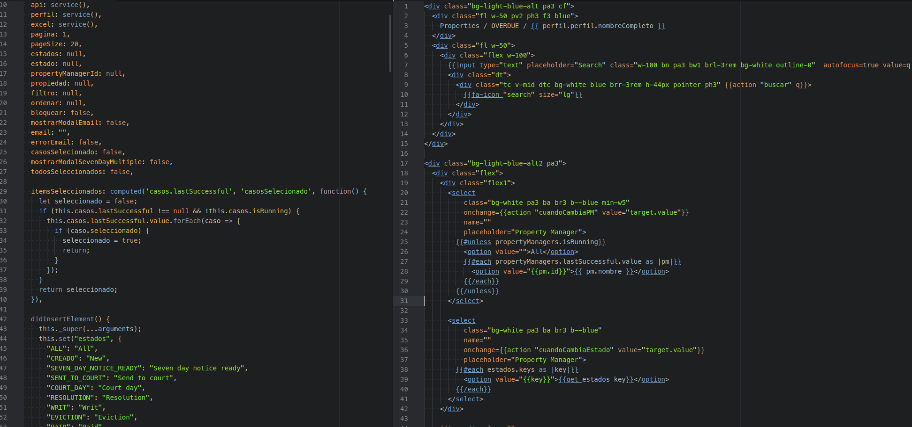

# wyrven-theme-syntax

Theme personalizado para el editor [Atom](https://atom.io/)

Descargar ultima versión desde [github/l2radamanthys/wyrven-theme-syntax](https://github.com/l2radamanthys/wyrven-theme-syntax)
